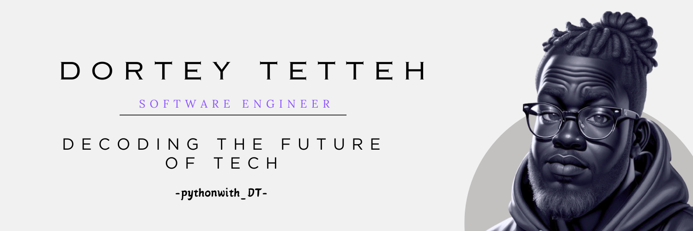

# Hi am Dortey Tetteh 💻 

👋 **Hello World!**

I'm Dortey Tetteh, a passionate software developer with a love for all things Python 🐍. My journey in the coding universe started with a curiosity to explore the endless possibilities of turning lines of code into solutions.

### 🔭 I’m currently working on...

Diving deep into the realms of AI, UI, and Pythonic wonders. Exploring the intersections of technology and creativity is where I find my groove. Currently, you'll find me immersed in Javascript.

### 🌱 I’m currently learning...

Never-ending learning is my motto. From mastering the intricacies of Python to experimenting with the latest in AI, my quest for knowledge knows no bounds.

### 👯 I’m looking to collaborate on...

Open-source projects that make a meaningful impact. If you have an exciting project or need a pair of coding hands, count me in!

### 💬 Ask me about...

Python, AI, UI/UX design, or anything tech-related. I'm here to share knowledge and learn from the vibrant coding community.

### ⚡ Fun fact...

When not immersed in code, you'll find me [hobby or interest outside of coding, e.g., exploring photography 📷].

Let's code the future together! 

